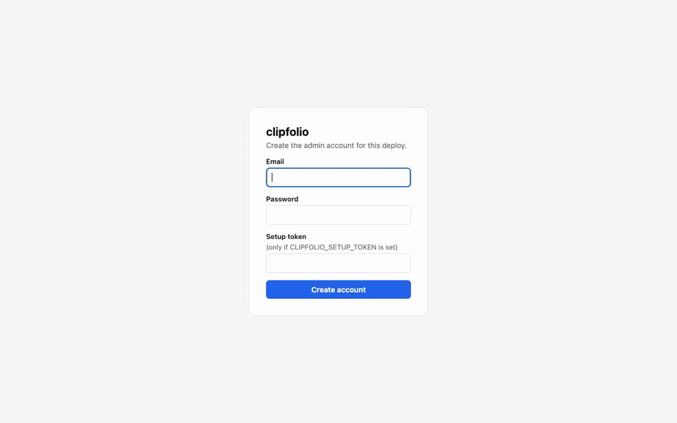
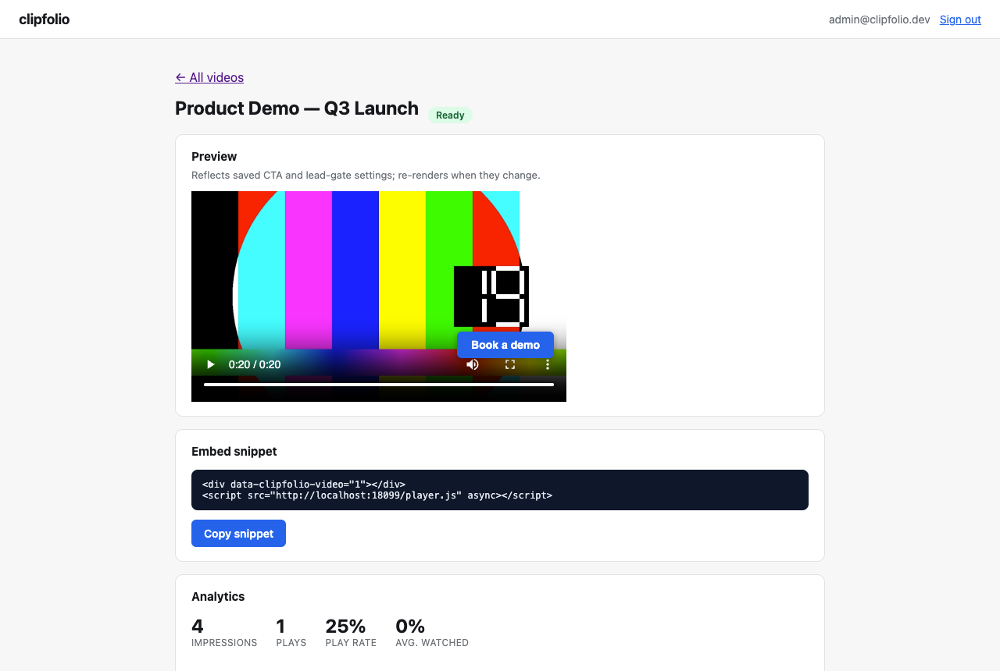

<div align="center">


**clipfolio** — self-hosted business video hosting with the analytics layer Wistia and Vimeo Business
charge a subscription for. Upload a video, embed one `<script>` tag, and get a drop-off curve,
clickable CTA overlays, and an email-capture gate on your own infrastructure.

[](https://github.com/Laaaaksh/clipfolio/stargazers)
[](#why-switch)

[](https://github.com/Laaaaksh/clipfolio/actions/workflows/ci.yml)
[](https://github.com/Laaaaksh/clipfolio/releases)
[](LICENSE)
[](go.mod)
[](#install)

**[Install](#install) • [Usage](#usage) • [Configuration](#configuration) • [Changelog](CHANGELOG.md) • [Contributing](CONTRIBUTING.md) • [License](LICENSE)**

**[Code of conduct](CODE_OF_CONDUCT.md) • [Contributing](CONTRIBUTING.md) • [License](LICENSE) • [Security](SECURITY.md)**

</div>

## What it does

- Upload a video and get adaptive-bitrate HLS back automatically (`ffmpeg` transcodes 360p/720p/1080p renditions server-side)
- Embed it anywhere with one `<script>` tag and a `<div>` — no iframe, no external account for viewers
- See a real drop-off (retention) curve per video — the same "where do people stop watching" chart Wistia's own dashboard is known for
- Drop a clickable CTA overlay at a timestamp or at video end ("Book a demo", "Start free trial", anything)
- Gate playback behind an email-capture form, before playback or at a timestamp, and export leads via a webhook into whatever CRM you already use
- Track impressions, play rate, and average watch percentage per video, updating live while people watch
- Runs as one Go binary plus Postgres and an S3-compatible bucket — self-hosted, no telemetry, no phone-home



*Real capture from the running app: a lead-gated viewer session followed by the dashboard's own analytics for that session — see [Is the demo real?](#is-the-demo-real) below.*

## Why switch

Wistia's Business + Lead-gen tier is **$329/month** for what is, underneath, a hosting-plus-analytics
layer with CTA overlays and lead capture on top of `<video>`. If you already pay for object storage
(S3, R2, Backblaze B2) or can run a small bucket for a few dollars a month, clipfolio gives you that
same analytics-plus-CTA-plus-lead-capture layer with no per-seat, per-video, or per-view fee — you
just bring your own bucket.

No open-source project fills this gap today: PeerTube is built for public/federated video discovery
(a YouTube shape), not private embedded marketing video with CTA overlays and lead capture. Read the
honest caveat on "free to run" below before you decide.

## Requirements

- **ffmpeg** and **ffprobe** on the host (or in the container image) — clipfolio shells out to them for transcoding and thumbnails
- **Postgres** 14+ for metadata
- **An S3-compatible bucket** for video storage — AWS S3, Cloudflare R2, Backblaze B2, or a self-hosted MinIO all work. This is the one place "free to run" needs a real answer: transcoding CPU time and storage/bandwidth cost money somewhere, even if the *software* is free. clipfolio doesn't bundle or subsidize storage.
- Go 1.26+ and Node 20+ **only if building from source** — the Docker image needs neither

## Install

The fastest way to a working instance — Postgres, MinIO (a local S3-compatible bucket), and clipfolio itself, all with no cloud account required to try it:

```bash
git clone https://github.com/Laaaaksh/clipfolio.git
cd clipfolio
cp .env.example .env
docker compose up --build
```

Then open `http://localhost:8080`, create the admin account, and upload a video.

If port 8080 is already taken on your machine, edit the `"8080:8080"` line under the `clipfolio`
service in `docker-compose.yml` to `"<some-other-port>:8080"` and use that port instead.

MinIO is meant for trying clipfolio out and for small self-hosted deploys behind your own reverse
proxy. For a real deploy reachable from the public internet, point the same environment variables at
a real bucket (S3, R2, B2) with public read access on the video prefix — see
[Configuration](#configuration).

### Building from source

```bash
git clone https://github.com/Laaaaksh/clipfolio.git
cd clipfolio
make frontend   # builds the dashboard and embeddable player (needs Node)
make build      # builds bin/clipfolio (needs Go)
```

## Usage

1. Sign in (or create the admin account on first run) at the dashboard root.
2. Create a video, then upload an MP4/MOV/WebM file. clipfolio transcodes it to HLS in the background — the page updates automatically once it's ready.
3. Copy the embed snippet from the video's page:
   ```html
   <div data-clipfolio-video="1"></div>
   <script src="https://your-clipfolio-host.example.com/player.js" async></script>
   ```
   Paste it into any page. The player handles HLS playback (via `hls.js` where needed), CTA overlays, and the lead-capture gate on its own.
4. Add a CTA ("Book a demo" at the end, or at a specific timestamp) and, optionally, an email-capture gate — from the same video page.
5. Watch the drop-off curve, play rate, and captured leads update as real viewers watch.

## Configuration

All configuration is environment variables (see `.env.example`):

| Variable | Required | Purpose |
|---|---|---|
| `CLIPFOLIO_ADDR` | no (default `:8080`) | HTTP listen address |
| `CLIPFOLIO_DATABASE_URL` | yes | Postgres connection string |
| `CLIPFOLIO_S3_ENDPOINT` | no (defaults to AWS) | S3-compatible endpoint, e.g. your MinIO/R2/B2 URL |
| `CLIPFOLIO_S3_REGION` | no (default `us-east-1`) | Bucket region |
| `CLIPFOLIO_S3_BUCKET` | yes | Bucket name |
| `CLIPFOLIO_S3_ACCESS_KEY` / `CLIPFOLIO_S3_SECRET_KEY` | yes | Bucket credentials |
| `CLIPFOLIO_S3_FORCE_PATH_STYLE` | no (default `true`) | Path-style URLs — required by MinIO/R2/B2, set `false` for AWS S3 virtual-hosted buckets |
| `CLIPFOLIO_S3_PUBLIC_BASE_URL` | no | The URL prefix viewers fetch video from — set this to a CDN in front of your bucket if you have one |
| `CLIPFOLIO_SETUP_TOKEN` | no | If set, required to create the first admin account — protects a freshly deployed instance before you claim it |

Lead webhooks are configured per-video from the dashboard, not via environment variables — point
each video's webhook at your CRM's inbound URL and clipfolio POSTs a JSON payload
(`{event, videoId, sessionId, email, name, capturedAt}`) on every capture.

## Limits

Read this before you install anything:

- **The dashboard and embeddable player have no automated tests.** The Go backend is thoroughly
  covered (37 tests against real Postgres and real ffmpeg, no mocks); the React dashboard and the
  TypeScript player — the actual UI a viewer sees — are currently verified by hand, not by CI. See
  [CONTRIBUTING.md](CONTRIBUTING.md#frontend-testing-known-gap).
- **Transcoding runs in-process, not on a job queue.** A small fixed pool of goroutines transcodes
  uploads on the same host as the API server — fine for a single self-hosted instance, but it
  doesn't horizontally scale across multiple instances or resume a job that was mid-transcode when
  the process restarted.
- **No native CRM integrations.** Leads reach you through a single per-video webhook; wiring that
  into HubSpot, Salesforce, or anything else is on you.
- **No live streaming, transcripts, or captions.** Upload-and-transcode only.
- **No SSO.** Email and password only.
- **Storage and transcoding compute aren't free just because the software is.** You bring your own
  S3-compatible bucket and the CPU time to transcode; clipfolio doesn't bundle or subsidize either.

## Is the demo real?

Yes. The GIF above and the screenshot below are real captures from the running app
(`docker compose up`, a synthetic ffmpeg-generated test clip, driven through the actual dashboard
and embedded player in a real browser) — not a mockup. See [CONTRIBUTING.md](CONTRIBUTING.md) for
how to reproduce it.



## Changelog

Notable changes per release live in [CHANGELOG.md](CHANGELOG.md).

## Contributing

Contributions are welcome. See [CONTRIBUTING.md](CONTRIBUTING.md).

## Security

Found a security issue? Please report it privately — see [SECURITY.md](SECURITY.md).

## Star this repo

If clipfolio saves you a Wistia bill, [leave a star](https://github.com/Laaaaksh/clipfolio/stargazers) — it helps other people find it.

<a href="https://www.star-history.com/?repos=laaaaksh%2Fclipfolio&type=date&legend=top-left">
 <picture>
   <source media="(prefers-color-scheme: dark)" srcset="https://api.star-history.com/chart?repos=laaaaksh/clipfolio&type=date&theme=dark&legend=top-left" />
   <source media="(prefers-color-scheme: light)" srcset="https://api.star-history.com/chart?repos=laaaaksh/clipfolio&type=date&legend=top-left" />
   
 </picture>
</a>

## License

MIT - see [LICENSE](LICENSE).
